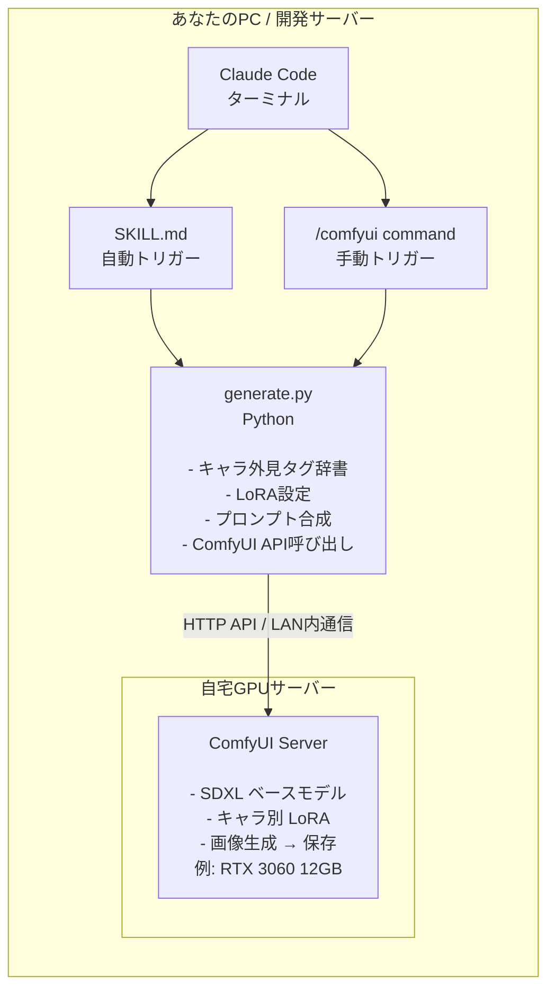

---

## この記事は誰のためか

**以下のすべてに心当たりがある人**向けです。

- 自宅にGPU搭載サーバーがある（あるいは、これから組む気満々の人）
- RunPodやNano BananaなどのクラウドGPUに月額課金するのはなんか違う。**自分のマシンで回したい**
- Claude Codeを日常的に使っていて、「テキストだけじゃなくて画像も出せたら」と思ったことがある
- 逸般の誤家庭の住人、またはその予備軍…！？

**こんな人にも対応しています：**

- 「GPUはあるけどComfyUIは初めて」→ 後続記事で一から整理する予定です
- 「Windowsのゲーミングで十分？」→ 十分でしょう、そこからでも始められます
- 「Claude Codeって何なの？」→ 大丈夫、とりあえずコピペでいけるので試してみるとよい

この記事で紹介するのは、**自宅のComfyUIサーバーに、Claude Codeからコマンド一発で画像生成リクエストを飛ばす**までの仕組みです。


---

## なぜクラウドGPUじゃダメなのか

RunPodは優秀なサービスです。RTX 4090で1時間$0.69。一見安い。


でも、使ったことがある人ならわかるはず。**イラッとポイント**がある。（調べると出てきます）

- **サービス終了のたびにストレージが消える**。起動するたびにSDXLモデル（6GB）をダウンロードし直す。毎回、毎回ですね…
- 永続ストレージにすれば消えないが、**追加課金**。ディスクI/Oも遅い
- Podを再起動したら**GPUリソースが枯渇**していてCPUのみで起動していた（えっ、使えないん？）
- 「ちょっと1枚だけ生成したい」のに、Pod起動 → モデルロードで数分待ちも。**すぐに使えない**
- 好きなタイミングに回したいのに**従量課金が気になって手が止まる**
- そもそも——**俺のマシンにGPUが刺さってるのに、なぜ他人のGPUに金を払うのか**？？

最後の一行に共感した人、この記事はあなたのためです。RunPodに興味がないならなおさらですね。

自宅のマシンにComfyUIを常駐させておけば、**起動待ちゼロ・ダウンロード不要・従量課金なし**。当たり前ですけどね。
あとは**Claude Codeから呼び出す仕組み**さえあれば、
ターミナルから一言で自分好みのAIキャラ画像を生成できる。

---

## 前提条件

この記事で紹介する構成の前提です。
**全部揃っていなくても大丈夫**——まずは全体像を掴むところから始めます。

### ハードウェア

| 項目 | 最低ライン | 推奨 | 備考 |
|---|---|---|---|
| GPU | VRAM 8GB（GTX 1070） | **VRAM 12GB（RTX 3060以上）** | SDXLなら12GBほぼ必須 |
| RAM | 16GB | 32GB | モデルロードで食われる |
| ストレージ | 50GB空き | 100GB〜 | モデル1つ6GB、LoRA1つ数百MB |

:::message alert
**2026年4月現在、GPU市場は地獄です。**

RTX 3060 12GBは「コスパ最強」と言われ続けていますが、**12GBモデルは市場からほぼ消滅**しています。ヤフオク、メルカリにあるのはほぼ8GBじゃないですかね。
新品は6〜8万円台に高騰（発売当時の約2倍）、中古でも4万円前後。しかも在庫が見つからない。

再販の噂はありますが、出てくるのは**8GBモデル**とも言われており、SDXL用途には厳しい。


出典：価格.com

**現実的な選択肢（2026年4月時点）：**

| GPU | 実売価格帯 | VRAM | SDXL適性 | 入手性 |
|---|---|---|---|---|
| RTX 3060 12GB（中古） | 3〜4万円 | 12GB | **最適** | 争奪戦 |
| RTX 4060 | 4.5〜5万円 | 8GB | ギリギリ | 普通 |
| **RTX 5060** | **5.5万円〜** | **8GB** | **ギリギリ** | **新世代だが8GB問題** |
| RTX 5060 Ti 16GB | 9万円〜 | 16GB | 余裕 | 品薄 |
| RTX 4070以上 | 8万円〜 | 12GB+ | 余裕 | 高い |

**筆者の本音**: 中古のRTX 3060 12GBをメルカリやヤフオクで狙い撃ちするのが、2026年4月時点では一番現実的。
ただし**マイニング酷使品を掴まないよう注意**が必要です。

8GB VRAMでもSDXLは動きますが、解像度やバッチサイズに制限が出ます。
「とりあえず始めたい」なら8GBでOKですが、後悔しないためにも、12GB以上を手に入れたいです。逸般を目指すならなおさらですね。

:::

> 「結局どれ買えばいい？」問題は、環境構築編として別記事で詳しく扱う予定です。
> Proxmox上のGPUパススルー構成もカバーします。そう、我々はそういう人種です。

### ComfyUIの動作環境

ComfyUIは**WindowsでもLinuxでも動きます**。

| 構成 | 難易度 | 備考 |
|---|---|---|
| **Windows（普段使いPC）** | ★☆☆ | 一番手軽。GPU搭載PCならすぐ始められる |
| **Linux（Ubuntu等）** | ★★☆ | サーバー用途に最適。常時起動・API運用向き |
| **Proxmox + GPU パススルー** | ★★★ | 逸般の誤家庭スタイル。VM内でGPU専有 |

ゲーミングPCにComfyUIをインストールするだけでも十分動きます。
WindowsのGUIからポチポチ使うなら、これが最短ルート。

ただし**Claude Codeから常時APIで叩く**用途を考えると、
専用のLinuxマシン（or VM）にComfyUIを常駐させるのが快適です。

> 筆者はUbuntuの専用VMを別途立ち上げてComfyUIを常駐させています。
> やりすぎではないと思っています…、逸般の誤家庭では標準構成って聞きましたので。

### ソフトウェア

| 項目 | 必要バージョン | 備考 |
|---|---|---|
| **Python** | 3.10以上 | generate.pyの実行に必要 |
| **ComfyUI** | 最新版 | APIモード対応必須 |
| **Claude Code** | 最新版 | Anthropic公式CLI |
| **ベースモデル** | SDXL系 | waiIllustrious推奨（後述） |
| **LoRA** | キャラ別 | civitai.comで好きなものを入手 |

### Claude Code のプラン

Claude Code は **Proプラン（$20/月）** で十分使えます。
Skill開発も画像生成の呼び出しも、Proの範囲で問題なく動きます。

> ここで紹介している範囲はProプランで再現可能です。
> まずは試してみて、使い倒すようになってからプランを検討すればOK。

---

## 完成するとこうなる

まず完成形を見てください。

### 例: AI秘書の画像を生成する

**ユーザー：**
```
> AI秘書の画像を生成して。オフィスで微笑んでる感じで。
```
**AI：**
```
Claude Code > [comfyui Skillが自動起動]
             キャラ: secretary
             シチュエーション: "office, gentle smile, looking at viewer, warm light"
             → generate.py secretary "office, gentle smile, ..."
             → ComfyUI APIに送信（http://127.0.0.1:8188）
             → 30〜60秒で画像生成完了
             → [画像を表示]
```


### 例: スラッシュコマンドで直接呼び出し

```
ユーザー > /comfyui secretary "reading documents, serious expression, glasses"

Claude Code > generate.py secretary "reading documents, serious expression, glasses"
             → [画像を表示]
```

**自然言語でもコマンドでも、どちらでも使えます。**

「AI秘書」は仮の名前です。あなたの好きなキャラクターに置き換えてください。
推しVTuber、オリキャラ、TRPGのキャラクター、なんでも。
LoRAさえあれば（あるいは作れば）何でもいけます。

---

## Claude Code Skillとは

Claude Code（Anthropic公式のCLIエージェント）には、
ユーザーが独自の機能を追加できる**Skill**と**Command**という2つの拡張の仕組みがあります。

### Skillの正体

Skillの実体は、プロジェクト内に配置した**マークダウンファイル + スクリプト**です。

```
your-project/
  .claude/
    skills/
      comfyui/                ← Skill名（自由に決めてOK）
        SKILL.md              ← Skillの定義書（自然言語で手順を記述）
        scripts/
          generate.py         ← 実行スクリプト（Python）
    commands/
      comfyui.md              ← /comfyui コマンド定義
```

`SKILL.md`に「何を、どういう手順で実行するか」を自然言語で書いておく。
Claude Codeはこれを読んで、文脈から自動的にスクリプトを呼び出してくれる。

### Skill vs Command

| | Skill | Command |
|---|---|---|
| 配置場所 | `.claude/skills/*/SKILL.md` | `.claude/commands/*.md` |
| トリガー | Claudeが会話文脈から**自動判定** | ユーザーが**`/コマンド名`で明示的に呼び出し** |
| 用途 | 「画像生成して」で自動発動 | `/comfyui secretary "..."` で確実に発動 |

今回は**両方**用意します。
普段は自然言語で呼び出し、確実に動かしたいときはコマンドで。

---

## システム構成の全体像




ポイントは**3層分離**：

1. **Skill層（SKILL.md）**: 自然言語 → 構造化データへの変換ルール。「AIへの業務マニュアル」
2. **スクリプト層（generate.py）**: キャラ設定・プロンプト合成・API呼び出し。**ここがPython**
3. **生成層（ComfyUI）**: 実際のGPU画像生成エンジン。自宅サーバーで動く

この分離のおかげで：
- キャラ追加 → generate.pyに辞書エントリを足すだけ
- ComfyUI設定変更 → Skill層は触らない
- Claude Codeのアップデート → スクリプト層には影響しない

---

## SKILL.md — 「AIへの業務マニュアル」をコピペで作る

SKILL.mdの構造を紹介します。これが一番面白いところ。

まずはSkill定義の最小形を見ていきます。
完全版をすぐ試したい場合は、下の `skills.zip` を使うのが確実です。

> **スクリプト一式をまとめてダウンロードしたい方はこちら:**
> [skills.zip をダウンロード](https://github.com/mightandshy/claude-code-comfyui-skill/releases/download/v1.0.0/skills.zip) — Windowsならエクスプローラー、macOSならFinderで解凍できます。
> 解凍した `skills` フォルダをプロジェクトの `.claude/` 直下に置き、最終的に `.claude/skills/comfyui/SKILL.md` になるように配置してください。
> ソースコード: [github.com/mightandshy/claude-code-comfyui-skill](https://github.com/mightandshy/claude-code-comfyui-skill)

```markdown
---
name: comfyui
description: >
  ComfyUIでキャラクター画像を生成するSkill。
  「画像を生成して」「〇〇の絵を描いて」などのキーワードでトリガーする。
---

# ComfyUI Image Generator

ComfyUI APIを使ってキャラクター画像を生成する。

## キャラクター一覧

| キー | キャラ | LoRA |
|------|--------|------|
| `secretary` | AI秘書 | your_lora.safetensors |

## 手順

### Step 1: 意図解析
メッセージからキャラクターとシチュエーションを特定する。
キャラが不明な場合はユーザーに確認する。

### Step 2: シチュエーションを英語タグに変換
日本語の描写を英語プロンプト（20〜40語程度）に翻訳する。

| 日本語 | 英語タグ例 |
|--------|-----------|
| オフィスで微笑む | office, gentle smile, looking at viewer |
| 怒ってこちらを見ている | angry expression, staring at viewer, arms crossed |
| 読書中 | reading a book, focused expression, warm light |

### Step 3: generate.py で画像生成を実行

python3 .claude/skills/comfyui/scripts/generate.py <character_key> "<situation_en>"

生成完了後、出力された画像パスを Read ツールで読み込んでユーザーに表示する。
```

続いて、コマンド定義も作ります。
`.claude/commands/comfyui.md` に以下をコピペ：

> `skills.zip` にはこのCommand定義は含まれていません。
> `/comfyui` で呼び出したい場合は、次のファイルを手動で作成してください。

```markdown
---
description: "ComfyUIでキャラクター画像を生成する"
---

`.claude/skills/comfyui/SKILL.md` を読み込んで、指示に従って画像を生成してください。

## ユーザーの指示

$ARGUMENTS
```

これだけで `/comfyui AI秘書 "笑顔で手を振っている"` が使えるようになります。

**「AIへの業務マニュアル」**というのは比喩じゃなくて、本当にそう。

人間の新人に渡すマニュアルと同じです。
「こういう依頼が来たら → こう解釈して → このコマンドを実行して」。
Claude Codeはこれを読んで、自律的に判断・実行してくれる。

つまり**Skill設計とは、業務マニュアルの設計**です。
プログラミングより、ドキュメント設計に近い。

---

## generate.py — Pythonで繋ぐ

generate.pyの核となる設計を紹介します。
外部ライブラリ不要（Python標準ライブラリのみ）で動くように書いています。

`.claude/skills/comfyui/scripts/generate.py` として保存してください。

### 全体構造（簡略版）

```python
#!/usr/bin/env python3
"""ComfyUI API経由でキャラクター画像を生成する"""

import sys, json, random, time, os
import urllib.request, urllib.error

# === 設定 ===================================================
COMFYUI_URL = "http://127.0.0.1:8188"  # あなたのComfyUIのアドレスに変更
OUTPUT_DIR = os.path.join(os.path.expanduser("~"), "comfyui_generated")

STYLE_PROMPT = "masterpiece, best quality, amazing quality, official art"
NEG_PROMPT = "bad quality, worst quality, bad anatomy, watermark"

# === キャラクター定義 ==========================================
# ここを自分のキャラに書き換えるだけでOK
CHARACTERS = {
    "secretary": {
        "name": "AI秘書",
        "appearance": "1girl, black hair, office lady, glasses, slender",
        "lora": "your_lora.safetensors",  # ← civitaiで入手したLoRAファイル名
        "lora_strength": 0.7,
    },
    # キャラを増やすならここにエントリを追加
}

# === プロンプト合成 ============================================
def build_prompt(character_key, situation):
    char = CHARACTERS[character_key]
    return f"{STYLE_PROMPT}, {char['appearance']}, {situation}"

# === ComfyUI API ==============================================
def queue_prompt(workflow):
    """ComfyUI APIにワークフローJSONを送信"""
    data = json.dumps({"prompt": workflow}).encode("utf-8")
    req = urllib.request.Request(
        f"{COMFYUI_URL}/prompt",
        data=data,
        headers={"Content-Type": "application/json"},
    )
    resp = json.loads(urllib.request.urlopen(req).read())
    return resp["prompt_id"]

def wait_for_completion(prompt_id, timeout=120):
    """生成完了を待つ（ポーリング）"""
    for _ in range(timeout):
        resp = json.loads(
            urllib.request.urlopen(f"{COMFYUI_URL}/history/{prompt_id}").read()
        )
        if prompt_id in resp:
            return resp[prompt_id]
        time.sleep(1)
    raise TimeoutError("ComfyUI generation timed out")

def download_image(history, prompt_id):
    """生成された画像をダウンロードして保存"""
    os.makedirs(OUTPUT_DIR, exist_ok=True)
    outputs = history["outputs"]
    for node_id in outputs:
        for img in outputs[node_id].get("images", []):
            filename = img["filename"]
            url = f"{COMFYUI_URL}/view?filename={filename}"
            save_path = os.path.join(OUTPUT_DIR, filename)
            urllib.request.urlretrieve(url, save_path)
            return save_path
    return None

# === ワークフロー構築 ==========================================
def build_workflow(prompt_text, lora_file, lora_strength, seed):
    """ComfyUI APIフォーマットのワークフローJSON"""
    # ※ ここはComfyUIのGUIで組んだワークフローを
    #    「APIフォーマットで保存」したJSONがベースになります。
    #    詳しくはComfyUI API編で解説します。
    workflow = {
        # ... ノード定義（長いのでComfyUI API編で扱います）
    }
    return workflow

# === メイン ====================================================
def main():
    if len(sys.argv) < 3:
        print("Usage: python3 generate.py <character> \"<situation>\"")
        print(f"Characters: {', '.join(CHARACTERS.keys())}")
        sys.exit(1)

    char_key = sys.argv[1]
    situation = sys.argv[2]
    seed = int(sys.argv[3]) if len(sys.argv) > 3 else random.randint(0, 2**32 - 1)

    if char_key not in CHARACTERS:
        print(f"Unknown character: {char_key}")
        print(f"Available: {', '.join(CHARACTERS.keys())}")
        sys.exit(1)

    char = CHARACTERS[char_key]
    prompt_text = build_prompt(char_key, situation)
    print(f"Generating: {char['name']} — {situation}")

    workflow = build_workflow(prompt_text, char["lora"], char["lora_strength"], seed)
    prompt_id = queue_prompt(workflow)
    print(f"Queued: {prompt_id} (waiting...)")

    history = wait_for_completion(prompt_id)
    image_path = download_image(history, prompt_id)

    if image_path:
        print(f"[FILE] {image_path}")
    else:
        print("Error: No image generated")
        sys.exit(1)

if __name__ == "__main__":
    main()
```

**外部ライブラリゼロ**。`pip install` 不要。Python 3.10以上なら**コピペで動きます**。

変更するのは3箇所だけ：

1. `COMFYUI_URL` — あなたのComfyUIのアドレス（同じPCで動かすなら `http://127.0.0.1:8188`）
2. `CHARACTERS` — キャラ名・外見タグ・LoRAファイル名
3. `build_workflow()` — ComfyUI GUIで作ったワークフローJSON

> `build_workflow()` の中身（ワークフローJSON）の作り方が一番のハードルです。
> GUIからJSONをエクスポートする手順も含めて、ComfyUI API編で詳しく扱う予定です。

---

## LoRAの探し方

キャラクターの外見を再現する鍵が**LoRA**（Low-Rank Adaptation）です。

### civitai.comで探す

[civitai.com](https://civitai.com) は、Stable Diffusion向けモデル・LoRAの最大のコミュニティサイトです。

- 「anime character SDXL」で検索 → 大量にヒット
- 好みのアニメキャラ名で検索 → 高確率で誰かが作っている
- オリジナルキャラ向けの汎用スタイルLoRAもある

> モデルやLoRAの選定は奥が深い世界です。
> モデル比較と選び方は、モデル・LoRA導入編で詳しく扱う予定です。

### ベースモデルの選定

| モデル | 特徴 | 備考 |
|---|---|---|
| **waiIllustrious** | アニメ系最強格。LoRA互換性高い | SDXL系。本構成で使用 |
| NoobAI-XL | waiIllustriousの派生。品質良好 | こちらも有力候補 |
| Pony Diffusion | リアル寄りアニメ | LoRA互換注意 |

SDXLベースなら**VRAM 12GB推奨**。ここだけは妥協しないほうがいい。

---

## 応用例: Skillの拡張アイデア

ここまでの仕組みが動けば、応用は自由自在です。いくつかアイデアを。

### 複数キャラの一括生成

```python
# CHARACTERSに複数キャラを登録しておけば
for key in CHARACTERS:
    generate(key, "standing, smile, white background")
# → 全キャラの立ち絵を一気に生成
```

### シチュエーション・プリセット

SKILL.mdに「よく使うシチュエーション」をテーブルで定義しておけば、
Claude Codeが「戦闘シーンで」→ `battle, dynamic pose, dramatic lighting` と自動変換してくれます。

### マルチエージェント連携

複数のAIエージェントが「協議」してプロンプトを練り上げる——という構成も可能です。
Skill同士を組み合わせることで、**企画 → プロンプト生成 → 画像生成**のパイプラインが作れます。

> マルチエージェント構成やキャラ別タグ設計など、さらに踏み込んだ内容は別記事で扱う予定です。

---

## 今後扱う予定のテーマ

この記事は、Claude Code × ComfyUI Skill構築の概要編です。
必要に応じて、以下のテーマを別記事として整理していきます。

| テーマ | 内容 | 対象 |
|---|---|---|
| GPU準備＆ComfyUIインストール | GPU選定・ComfyUI構築 | 環境未構築の人 |
| SDXLモデル＆LoRA | モデルDL・LoRA導入・ベースモデル比較 | モデル未導入の人 |
| ComfyUI API | ワークフローJSON・Python呼び出し | 技術的に深掘りしたい人 |
| Claude Code Skill化 | SKILL.md設計・Command連携 | Skillを作りたい人 |
| 応用編 | 複数キャラ・プロンプト改善・連携構成 | さらに深めたい人 |

---

## まとめ

Claude Code Skillを使えば：

- **ターミナルから一言で画像生成**できる
- **キャラ設定をPython辞書で管理**できる
- **自宅GPUサーバー + ComfyUI APIで完全自動化**できる
- **Skill同士を組み合わせてパイプラインも組める**

クラウドGPUに毎月課金するくらいなら、
自宅のGPUサーバーにComfyUIを立てて、Claude Codeから呼び出すほうが
**速い・安い・自由**の三拍子が揃います。

クラウドGPUに払い続けるか、自宅のGPUを自分の制作環境として育てるか。
逸般の誤家庭の住人なら、答えは決まっているはずです。

環境構築やSkill化の詳細は、別記事として順番に整理していく予定です。
まずはこの全体像を掴んでもらえたら。

---

*この記事は [miraclest.com](https://miraclest.com/) ブログ記事の一部です。*
*自宅GPUサーバーで動かすAI画像生成の世界、一緒に構築しませんか。*
